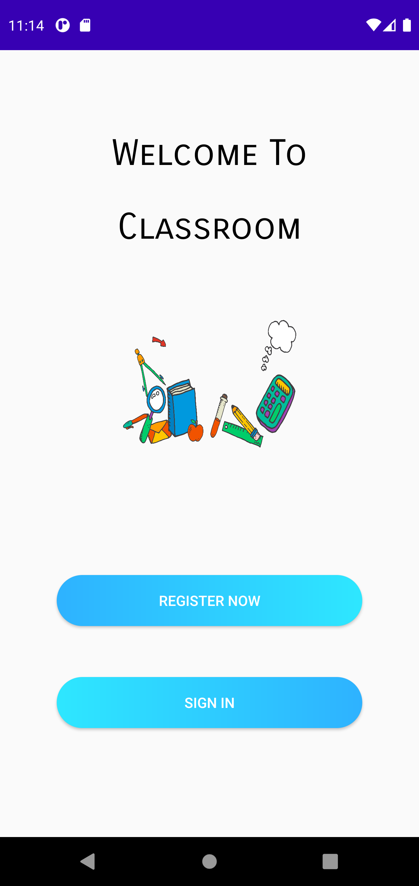
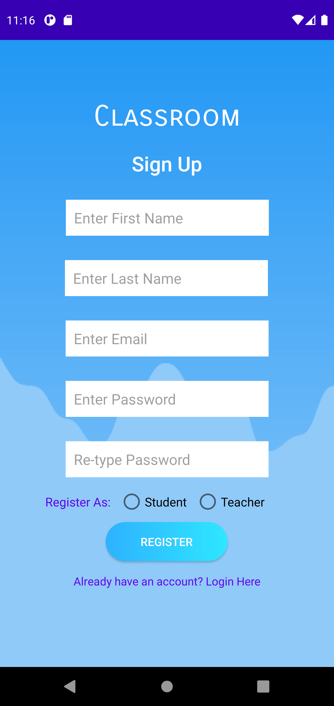
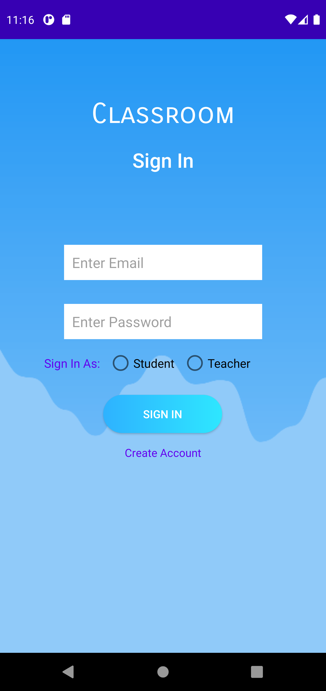
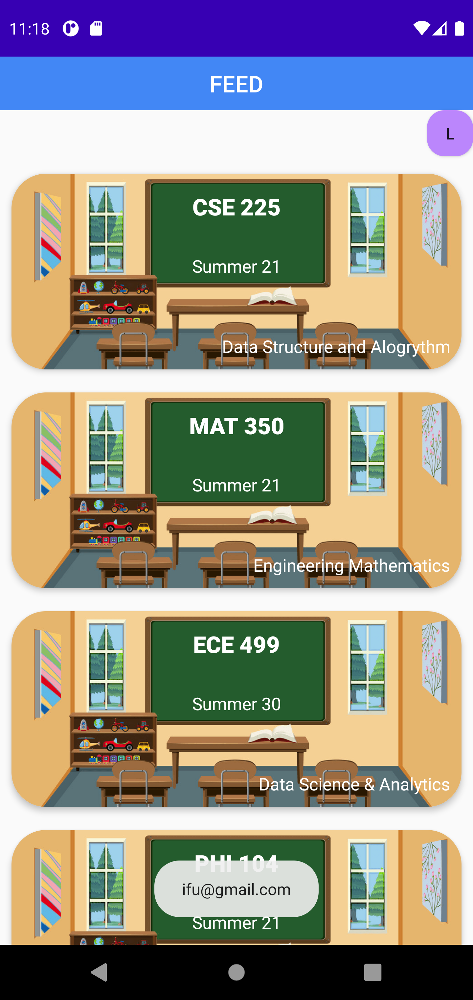
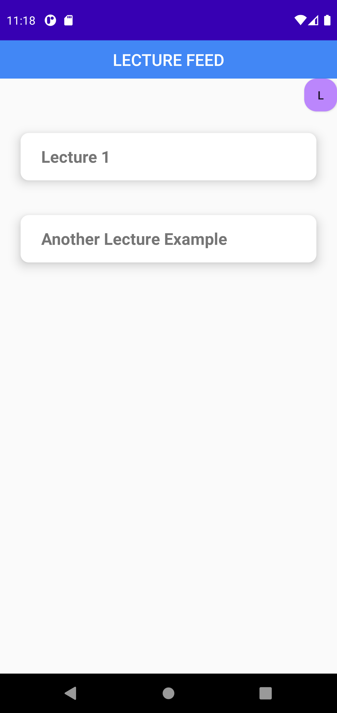
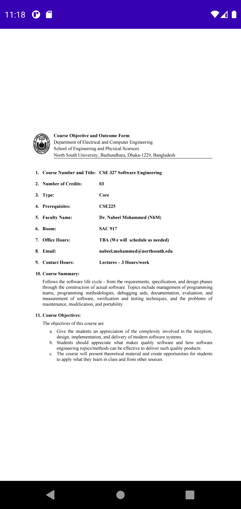

# Online-Classroom
An android online classroom app that connects to REST API backend, with a web portal.
***This was a project for my course CSE 327, Software Engineering.***

## Screenshots of the app:

I only developed the android and REST api parts. 
Kudos if you are here :v: :innocent: :space_invader:
